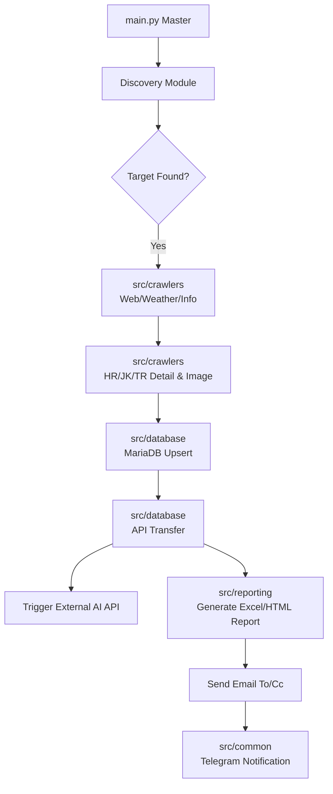

# 🐎 Netkeiba GIGA Crawler Master Pipeline

## 1. 프로젝트 개요 (Overview)
본 프로젝트는 일본 최대 경마 플랫폼 'Netkeiba(넷케이바)'의 데이터를 수집, 가공, 분석 및 보고하는 **전과정 자동화 데이터 파이프라인**입니다. 단순한 크롤링을 넘어 데이터베이스(MariaDB) 적재, AI 예측 모델 연동, 그리고 최종 결과 리포트 발행까지 하나의 유기적인 시스템으로 통합되어 있습니다.

---

## 2. 주요 핵심 기능 (Core Features)

### 🤖 완전 자동화 오케스트레이션 (`main.py`)
- **스마트 타겟 탐색 (Dynamic Discovery)**: 날짜별로 도쿄, 나카야마, 한신, 교토 등 주요 경기장의 개최 여부를 자동으로 탐지합니다.
- **다중 자동화 모드 (`--auto`)**:
  - `--auto 2/3`: 이번 주 토/일요일 경기 계획(출마표) 자동 수집 및 AI 예측 API 호출.
  - `--auto 4/5`: 지난 토/일요일 경기 결과 수집, DB 업로드 및 **결과 비교 리포트 자동 발송**.
  - `--auto 6`: 지난 주말 경기들의 구간별 기록(Lap Time) 자동 업데이트.
- **실시간 알림**: 작업의 시작, 성공, 실패 여부를 **Telegram Bot**을 통해 실시간으로 전송합니다.

### 📊 데이터 정밀 수집 및 분석 (`src/crawlers`)
- **전방위 크롤링**: 경기 정보(WebCrawler), 날씨/마장(WeatherCrawler), 상세 프로필(HR/JK/TR Crawler)을 연쇄적으로 수집합니다.
- **날씨 디코딩**: 넷케이바 특유의 난독화된 실시간 예보 데이터를 분석하여 수치화합니다.
- **실시간 변동 추적 (`InformationCrawler`)**: 출주 취소, 기수 변경 등 실시간 공지사항을 즉각적으로 파악합니다.
- **견고한 봇 방어 우회**: 세션 유지, 지능형 대기(`wait_for_selector`, `networkidle`), 403 차단 방지를 위한 인증 상태 재사용 등 최신 스크래핑 기법을 적용했습니다.

### 🗄️ 데이터베이스 및 시스템 통합 (`src/database`)
- **2단계 데이터 이관 전략**: 수집된 CSV를 임시 테이블(`tmp_races`)에 적재한 후, 검증을 거쳐 최종 API용 테이블로 안전하게 이관합니다.
- **AI API 트리거**: 데이터 준비가 완료되면 외부 AI 예측 시스템(`j.mafeel.ai`)에 즉각적으로 API 요청을 보내 분석을 시작합니다.

### 📧 스마트 리포팅 시스템 (`src/reporting`)
- **다국어 맞춤형 리포트**: 
  - 일본 경마(`email_report.py`): 예측/실제 인기 대칭 컬럼 적용 및 적중 하이라이트.
  - 한국 경마(`email_report_kor.py`): 전용 템플릿 사용.
- **고급 HTML 디자인**: 경주번호 단위로 시각적 구분이 용이한 굵은 경계선(3px solid black) 적용 및 모바일/웹 이메일 환경에 최적화된 테이블 렌더링.
- **SMTP 이메일 배포**: 생성된 리포트를 설정된 수신자(To) 및 참조자(Cc)에게 자동으로 발송합니다.

---

## 3. 시스템 아키텍처 (Architecture)



---

## 4. 모듈 구조 (Directory Structure)

프로젝트는 유지보수성과 확장성을 위해 각 도메인별로 분리된 구조를 가집니다.

- `src/crawlers/`: 데이터 수집(Netkeiba, HRNOCrawler 등) 및 파일 다운로드 로직.
- `src/database/`: MariaDB 연동, 임시/최종 테이블 적재 및 데이터 이관 로직.
- `src/reporting/`: 분석 데이터 기반의 이메일 본문 생성(HTML) 및 엑셀 리포트 포매팅 로직.
- `src/common/`: 유틸리티, 로깅, 설정 로드, 텔레그램 알림 등 공통 기능.

---

## 5. 운영 가이드 (Operation Guide)

### 🚀 실행 방법
```bash
# 모든 기능이 포함된 마스터 스크립트 실행
python main.py
```

### 🛠️ 주요 모드 설명 (CLI Menu)
1. **과거 결과 수집**: 특정 날짜/장소의 데이터를 소급 수집합니다.
2. **주말 계획 수집**: 이번 주 열릴 경기의 출마표와 날씨를 미리 확보합니다.
6. **DB 업로드/이관**: 수집된 CSV 데이터를 MariaDB로 안전하게 전송합니다.
10. **구간 기록 업데이트**: 경기 종료 후 추가되는 세부 기록(Lap Time)을 보강합니다.

---

## 6. 기술 스택 (Tech Stack)
- **Language**: Python 3.x
- **Library**: Playwright (Async 인증/세션), BeautifulSoup4, Pandas, Openpyxl
- **Database**: MariaDB (PyMySQL)
- **Communication**: SMTP (Email), Telegram Bot API
- **Infrastructure**: Naver Works (발신계정), JRA/Netkeiba Data Source

---

## 7. 문제 해결 및 아키텍처 개선 (Troubleshooting)

### 🚨 아키텍처 리팩토링 및 403 에러 대응
- **구조 개선**: 비대해진 코드를 `src/` 디렉토리 하위의 독립적인 모듈(crawlers, database, reporting, common)로 분리하여 유지보수성을 극대화했습니다.
- **안정성 확보**: 잦은 403 차단을 방지하기 위해 로그인 세션을 재사용하고, 지능적인 대기 로직(networkidle) 및 자동 정리(cleanup) 기능을 추가하여 24/7 중단 없이 구동 가능한 수준의 안정성을 확보했습니다.

---

## 8. 향후 로드맵 (Roadmap)
- [x] **모듈화 및 비동기 고도화**: 도메인별 구조 분리 및 Playwright 비동기 최적화.
- [ ] **Docker 컨테이너화**: 실행 환경 일관성 유지 및 배포 자동화.
- [ ] **대시보드 구축**: DB 데이터를 시각화하여 실시간 승률 및 적중률 모니터링.

---
*본 문서는 시스템의 지속적인 기능 추가에 따라 주기적으로 업데이트됩니다.*
