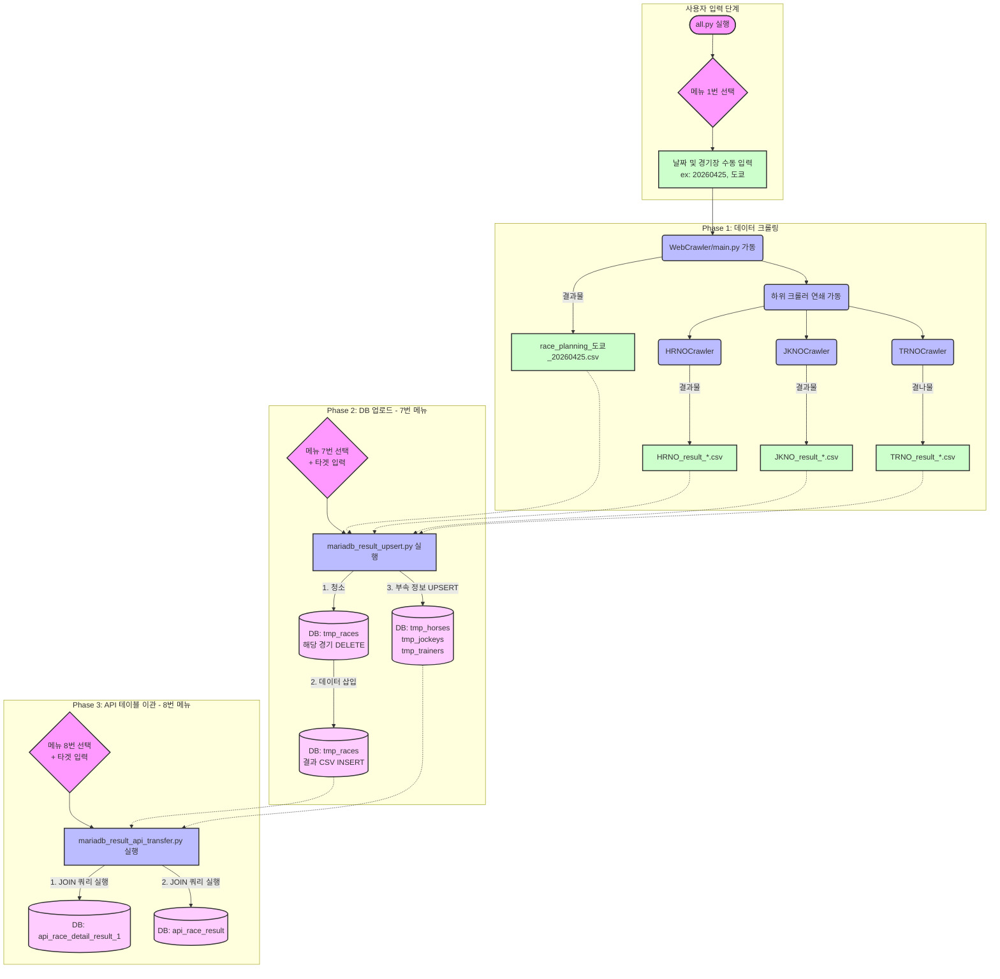

# 🐎 Mode 1 (과거 경기 결과) 파이프라인 전체 흐름도

과거 경기 결과 데이터가 수집되어 최종 API 테이블까지 안착하는 전체 과정을 한눈에 볼 수 있도록 도식화했습니다.

### 💡 주요 핵심 포인트
1. **분리된 크롤링과 적재**: 크롤링(`메뉴 1`)과 적재(`메뉴 7`), 이관(`메뉴 8`)이 완전히 분리되어 있어, DB가 끊기더라도 힘들게 수집한 CSV 데이터는 안전하게 보존됩니다.
2. **선행 청소 (DELETE)**: 7번 기능에서 `tmp_races`에 결과를 밀어넣기 직전, **`DELETE`**를 먼저 쳐서 취소마(Scratched Horse)나 변경된 출전 정보를 깨끗하게 리셋합니다.
3. **무결성 유지 (Rollback)**: 7번, 8번 기능은 내부적으로 트랜잭션 단위로 묶여있어, 중간에 오류가 발생하면 쪼개져서 들어간 데이터들을 싹 없었던 일(Rollback)로 만들고 재시도합니다.
